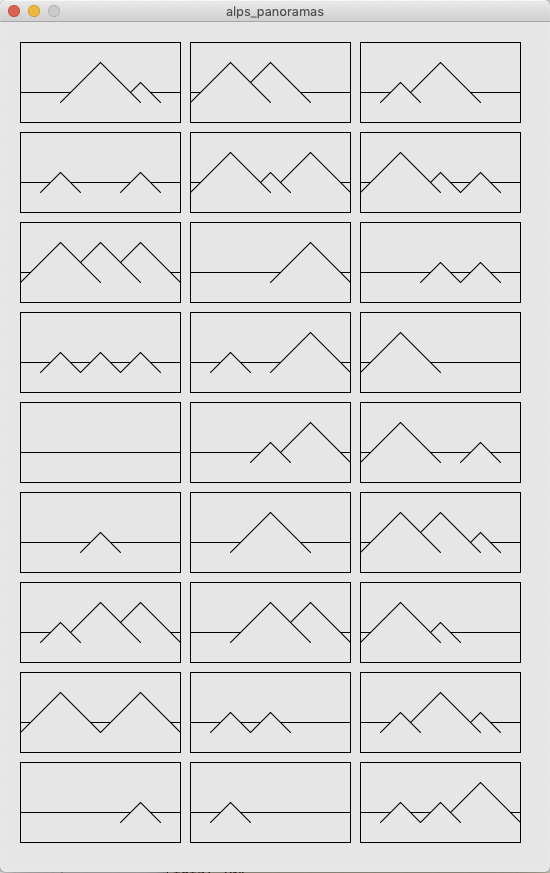

# scara

# Mechpen

Processing sketch to load SVG files, scale and move them and export
them to gcode.
Also hatching of separate paths is possible.

# Alps Panoramas

Processing sketch to draw alps panoramas (3^3 = 27 panorams).
Drawing is saved as SVG.

# Wavy Spirals

Processing sketch to draw wavy spirals.
Drawings can be saved as SVG.

